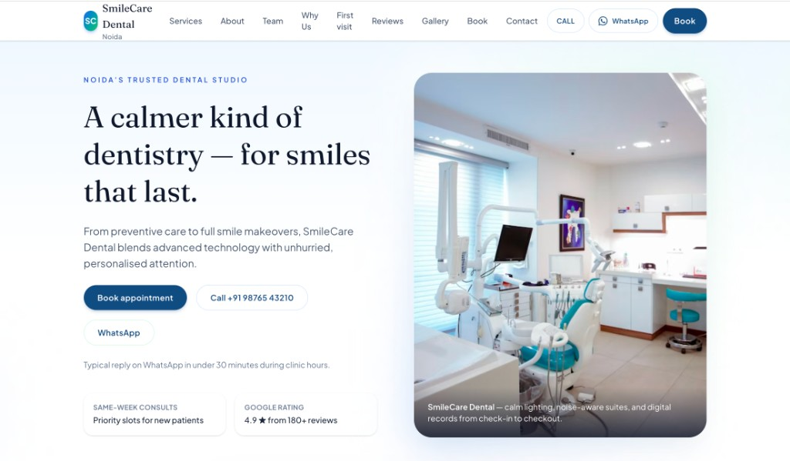
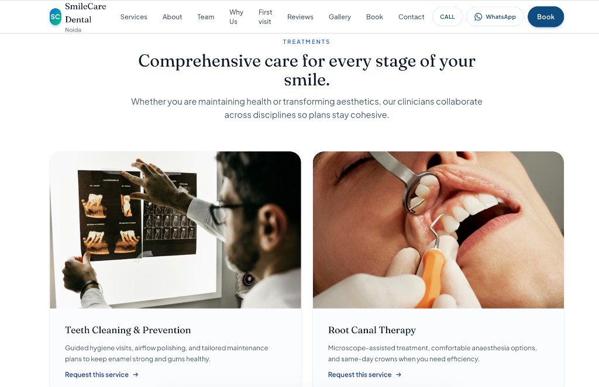
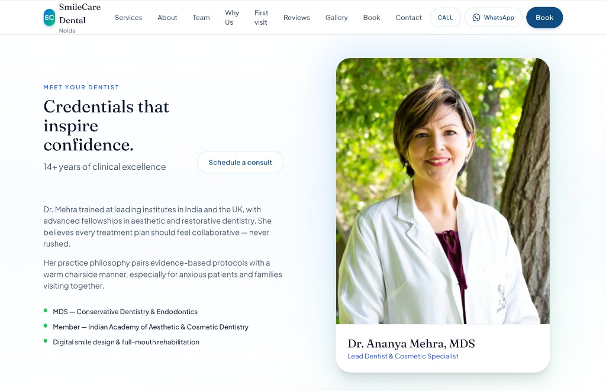

# SmileCare Dental — marketing site

A production-style marketing landing page for **SmileCare Dental Noida**: responsive layout, accessible navigation, booking and WhatsApp flows, and content driven from a single TypeScript module. Built with **React 19**, **TypeScript**, **Vite 8**, and **Tailwind CSS 4**.

[**Live demo**](https://dentalclinic-indol.vercel.app/)

---

## Highlights

- **Single-page experience** with anchored sections: hero, trust signals, services, lead dentist profile, team, differentiators, first visit, testimonials, before/after gallery, booking form, and contact.
- **Conversion-focused UI**: sticky booking affordance, call and WhatsApp actions, and structured contact details (all configurable in `src/data/siteContent.ts`).
- **Accessible baseline**: skip link to main content, semantic landmarks, and keyboard-friendly patterns alongside the visual polish.

---

## Tech stack

| Area        | Choice                                      |
| ----------- | ------------------------------------------- |
| UI          | React 19 + TypeScript                       |
| Bundler     | Vite 8                                      |
| Styling     | Tailwind CSS 4 (`@tailwindcss/vite`)        |
| Linting     | ESLint 9 + `typescript-eslint`              |

---

## Quick start

```bash
npm install
npm run dev
```

**Production build**

```bash
npm run build
npm run preview
```

**Lint**

```bash
npm run lint
```

---

## Project structure (overview)

```
src/
  App.tsx                 # Page section order
  data/siteContent.ts     # Copy, nav, clinic details, services, etc.
  components/
    layout/               # Header, footer, skip link, sticky bar
    sections/             # Hero, services, booking, …
    ui/                   # Shared primitives
```

To rebrand or change contact details, start with `src/data/siteContent.ts` and the assets under `public/` as needed.

---

## Demo & media

### Live site

**[https://dentalclinic-indol.vercel.app/](https://dentalclinic-indol.vercel.app/)**

### Screenshots

<p align="center">
  
  <br /><em>Hero — positioning, primary CTAs, and trust cues</em>
</p>

<p align="center">
  
  <br /><em>Services — treatment cards and request links</em>
</p>

<p align="center">
  
  <br /><em>About the dentist — credentials and consult CTA</em>
</p>

### Screen recording

Walkthrough of the UI (WebM). If the embedded player does not render in your viewer, open the file directly: [`docs/media/site-walkthrough.webm`](docs/media/site-walkthrough.webm).

<video src="docs/media/site-walkthrough.webm" controls playsinline width="100%">
  <a href="docs/media/site-walkthrough.webm">Download the walkthrough video</a>
</video>

> The recording was added from a local capture (`screen-capture.webm`); the canonical copy for the repository lives at **`docs/media/site-walkthrough.webm`**.

---

## Deployment notes

This repo is a static **Vite** SPA: build output is suitable for **Vercel**, **Netlify**, **Cloudflare Pages**, or any static host. Set the install command to `npm install` and the build command to `npm run build`, with publish directory `dist`.

---

## License

Private project (`"private": true` in `package.json`). Adjust licensing if you open-source the work.
